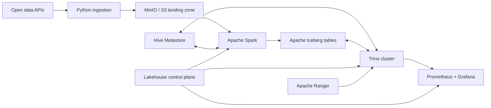

# Lakehouse Ops Platform

[](https://github.com/WhySatanic/lakehouse-ops-platform/actions/workflows/ci.yml)

A production-like reference platform for operating an Apache Iceberg lakehouse—not
just starting containers. The project combines a reproducible local data platform
with a Python control plane for ingestion, table health, maintenance, access policy,
observability, and performance experiments.

> Status: early access `0.7.0`. Open-Meteo ingestion works against the local filesystem
> and MinIO. The opt-in platform profiles include PostgreSQL-backed Hive Metastore and a
> Spark writer for S3-backed Iceberg bronze and validated silver tables. A Trino 483
> coordinator/worker profile reads the same tables through Hive Metastore.

This repository follows an **early-access, always-runnable** model. Releases stay in
the `0.x` line while interfaces evolve, but every version has a documented working
path. Planned components never masquerade as implemented features.

## Why this project exists

Lakehouse demos often stop at a successful `SELECT`. Operations begin after that:
small files accumulate, snapshots need retention policies, concurrent workloads
compete for resources, permissions drift, and changes need an audit trail. This
repository makes those concerns executable and measurable.

## Target platform



The planned stack is Trino, Spark, MinIO as an S3-compatible object store, Apache
Iceberg, Hive Metastore backed by PostgreSQL, Ranger, Prometheus, Grafana, and an
optional ClickHouse serving path. Everything runs locally with free/open-source
software. Open-Meteo is used only for a non-commercial portfolio workload under its
free API terms; deterministic fixtures keep CI independent of the external service.

## First working slice

The `lakeops` CLI fetches a bounded weather forecast, validates the columnar response,
and writes the original payload to an idempotent, checksum-addressed landing path.
Writes are atomic so a failed process cannot expose a partial object.

```bash
uv sync --dev
uv run lakeops ingest-weather \
  --name moscow \
  --latitude 55.7558 \
  --longitude 37.6173 \
  --forecast-days 3 \
  --output data/landing
```

For repeatable multi-location runs, use the checked-in manifest. The command limits
source concurrency, continues after individual failures, and emits a machine-readable
run report:

```bash
uv run lakeops ingest-weather-batch \
  --locations configs/locations.example.json \
  --forecast-days 3 \
  --max-workers 4 \
  --output data/landing
```

Run the quality gate:

```bash
uv run ruff check .
uv run pytest
```

For the first infrastructure-backed path, copy `.env.example` to `.env` and follow the
[MinIO landing-zone runbook](docs/runbooks/minio-landing.md). The S3 adapter uses a
conditional write, so concurrent ingestion attempts cannot overwrite an existing key.

Check storage readiness before a run. The command returns a non-zero exit code and a
JSON failure report when the directory is not writable or the S3 bucket is unavailable:

```bash
uv run lakeops doctor --output data/landing
uv run --env-file .env lakeops doctor --backend s3
```

Audit filesystem landing objects before replay or recovery. The audit validates the
document schema, recomputes its checksum, and checks that source, date, location, and
filename partitions agree with the payload:

```bash
uv run lakeops audit-landing --output data/landing
```

See the [landing integrity runbook](docs/runbooks/landing-integrity.md) for failure
handling and the checksum trust boundary.

The opt-in `catalog` profile runs Apache Hive Metastore with a persistent PostgreSQL
backend and a repeatable schema check. Follow the
[Hive Metastore runbook](docs/runbooks/hive-metastore.md) to start and verify it.

The opt-in `compute` profile syncs landed objects from MinIO, converts them into typed
weather observations with Spark, and idempotently merges them into an Iceberg table
registered in Hive Metastore. The
[Spark to Iceberg bronze runbook](docs/runbooks/spark-iceberg-bronze.md) includes the
landing-to-bronze execution. The
[validated silver runbook](docs/runbooks/spark-iceberg-silver.md) covers deterministic
deduplication, auditable rejects, and independent post-condition checks.

The opt-in `query` profile starts a Trino coordinator and worker with a read-only
Iceberg catalog backed by the same Hive Metastore and MinIO warehouse. Follow the
[Trino Iceberg query runbook](docs/runbooks/trino-iceberg-query.md) to start the cluster,
query the bronze and silver tables, and run the fixture acceptance check.

## Engineering scope

| Capability | Evidence planned in this repository |
|---|---|
| Trino operations | coordinator/worker topology, resource groups, query analysis, safe upgrades |
| Iceberg operations | partition evolution, compaction, snapshot expiration, time travel, schema evolution |
| Spark integration | idempotent batch pipelines, MERGE, maintenance procedures, failure recovery |
| S3 integration | MinIO policies, landing/warehouse layout, retries, consistency-oriented tests |
| Authorization | central role model, Ranger policies, row filters, column masking, audit trail |
| Observability | SLOs, OpenMetrics dashboards, alerts, query and table-health metrics |
| Performance | reproducible benchmark datasets, baselines, explain plans, before/after reports |
| Operations | runbooks, ADRs, release notes, disaster-recovery and failure-injection exercises |

See [Architecture](docs/architecture.md), [Roadmap](docs/roadmap.md), and the
[Release policy](docs/release-policy.md). Architecture choices are recorded as ADRs,
starting with [Hive Metastore first](docs/adr/0001-hive-metastore-first.md).

## Project principles

- Every milestone must end in executable evidence: a test, metric, benchmark, or runbook drill.
- No credentials, paid APIs, or cloud account are required for the default path.
- Versions are pinned and upgrades are reviewed as explicit changes.
- Documentation describes implemented behavior; future work is labelled as planned.
- Commit history reflects real engineering work and is never backdated or fabricated.

## License

MIT
