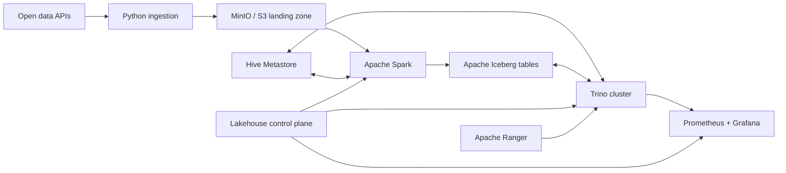

# Lakehouse Ops Platform

[](https://github.com/WhySatanic/lakehouse-ops-platform/actions/workflows/ci.yml)

A production-like reference platform for operating an Apache Iceberg lakehouse—not
just starting containers. The project combines a reproducible local data platform
with a Python control plane for ingestion, table health, maintenance, access policy,
observability, and performance experiments.

> Status: early access `0.45.0`. Open-Meteo ingestion works against the local filesystem
> and MinIO. The opt-in platform profiles include PostgreSQL-backed Hive Metastore and a
> Spark writer for S3-backed Iceberg bronze and validated silver tables. A Trino 483
> coordinator with two workers reads the same tables through Hive Metastore. The control
> plane collects Iceberg metadata, manages centralized Ranger policies, and creates
> explainable, non-mutating maintenance plans.

The optional observability profile exposes Prometheus readiness and live table signals,
plus provisioned Grafana readiness, Trino workload, maintenance, and freshness
dashboards. See
[the readiness runbook](docs/runbooks/prometheus-readiness.md).
The same profile routes sustained target failures through Alertmanager to a tested
local webhook receiver and verifies both firing and resolved notifications. Recorded
SLOs require 99% five-minute Trino query success, ingestion no older than 15 minutes,
and at most 10 undersized files in the demo table. See the
[platform SLO runbook](docs/runbooks/platform-slos.md).

This repository follows an **early-access, always-runnable** model. Releases stay in
the `0.x` line while interfaces evolve, but every version has a documented working
path. Planned components never masquerade as implemented features.

## Why this project exists

Lakehouse demos often stop at a successful `SELECT`. Operations begin after that:
small files accumulate, snapshots need retention policies, concurrent workloads
compete for resources, permissions drift, and changes need an audit trail. This
repository makes those concerns executable and measurable.

## Target platform



The reference stack is Trino, Spark, MinIO as an S3-compatible object store, Apache
Iceberg, Hive Metastore backed by PostgreSQL, Ranger, Prometheus, Grafana, and an
optional ClickHouse serving path. Everything runs locally with free/open-source
software. Open-Meteo is used only for a non-commercial portfolio workload under its
free API terms; deterministic fixtures keep CI independent of the external service.

The optional [ClickHouse serving experiment](docs/runbooks/clickhouse-serving.md) uses a
dedicated read-only MinIO identity to query the Spark-written silver and reject Iceberg
tables in place. Its executable evidence reconciles row counts, duplicate keys, and the
selected survivor without importing the data into ClickHouse native storage.

## First working slice

The `lakeops` CLI fetches a bounded weather forecast, validates the columnar response,
and writes the original payload to an idempotent, checksum-addressed landing path.
Writes are atomic so a failed process cannot expose a partial object.

```bash
uv sync --dev
uv run lakeops ingest-weather \
  --name moscow \
  --latitude 55.7558 \
  --longitude 37.6173 \
  --forecast-days 3 \
  --output data/landing
```

For repeatable multi-location runs, use the checked-in manifest. The command limits
source concurrency, continues after individual failures, and emits a machine-readable
run report:

```bash
uv run lakeops ingest-weather-batch \
  --locations configs/locations.example.json \
  --forecast-days 3 \
  --max-workers 4 \
  --output data/landing
```

Run the quality gate:

```bash
uv run ruff check .
uv run pytest
```

For the first infrastructure-backed path, copy `.env.example` to `.env` and follow the
[MinIO landing-zone runbook](docs/runbooks/minio-landing.md). The S3 adapter uses a
conditional write, so concurrent ingestion attempts cannot overwrite an existing key.
MinIO bootstrap also reconciles separate ingestion, Spark, and Trino identities. A live
matrix proves each account can reach only its assigned landing or warehouse boundary.

Check storage readiness before a run. The command returns a non-zero exit code and a
JSON failure report when the directory is not writable or the S3 bucket is unavailable:

```bash
uv run lakeops doctor --output data/landing
uv run --env-file .env lakeops doctor --backend s3
```

Audit filesystem landing objects before replay or recovery. The audit validates the
document schema, recomputes its checksum, and checks that source, date, location, and
filename partitions agree with the payload:

```bash
uv run lakeops audit-landing --output data/landing
```

See the [landing integrity runbook](docs/runbooks/landing-integrity.md) for failure
handling and the checksum trust boundary.

The opt-in `catalog` profile runs Apache Hive Metastore with a persistent PostgreSQL
backend and a repeatable schema check. Follow the
[Hive Metastore runbook](docs/runbooks/hive-metastore.md) to start and verify it.

The opt-in `compute` profile syncs landed objects from MinIO, converts them into typed
weather observations with Spark, and idempotently merges them into an Iceberg table
registered in Hive Metastore. The
[Spark to Iceberg bronze runbook](docs/runbooks/spark-iceberg-bronze.md) includes the
landing-to-bronze execution. The
[validated silver runbook](docs/runbooks/spark-iceberg-silver.md) covers deterministic
deduplication, auditable rejects, and independent post-condition checks.

The opt-in `query` profile starts a Trino coordinator and two workers with a read-only
Iceberg catalog backed by the same Hive Metastore and MinIO warehouse. Follow the
[Trino Iceberg query runbook](docs/runbooks/trino-iceberg-query.md) to start the cluster,
query the bronze and silver tables, and run the fixture acceptance check.

The [Trino worker shutdown runbook](docs/runbooks/trino-worker-shutdown.md) drains one
worker through Trino's management API, proves that it leaves discovery, and verifies
that the remaining worker still serves the Iceberg query path.

The [Trino abrupt worker recovery runbook](docs/runbooks/trino-worker-recovery.md)
proves an active task existed on the worker before `SIGKILL`, records the expected
in-flight query failure, retries against the surviving worker, and verifies unchanged
Iceberg rows, checksum, and snapshot after full capacity is restored.

The [Trino resource groups runbook](docs/runbooks/trino-resource-groups.md) defines
separate ingestion, BI, and ad-hoc budgets, then proves selector assignments and
ad-hoc queueing under contention with cancellable protocol-level queries.

The [Trino compaction experiment](docs/runbooks/trino-compaction-experiment.md) links
three-run query medians to the exact Iceberg snapshots and maintenance report before
and after data-file rewrite, without requiring latency to improve on a tiny fixture.

The [Trino partition pruning experiment](docs/runbooks/trino-partition-pruning-experiment.md)
compares identical unpartitioned and day-partitioned Iceberg tables, then requires lower
processed-row and physical-input volume for a single-day predicate.

The [Trino sort-order experiment](docs/runbooks/trino-sort-order-experiment.md) compares
identical unpartitioned tables with hash-scattered and globally ordered files. A selective
event-ID range must preserve results while reducing processed rows and object-store reads.

The [Trino metadata-cache experiment](docs/runbooks/trino-metadata-cache-experiment.md)
uses three coordinator restarts and cache-disabled control runs to separate cold/warm
metadata observations from general JVM and object-store warming.

The [Hive Metastore outage recovery drill](docs/runbooks/hive-metastore-recovery.md)
stops only the catalog service while its PostgreSQL metadata database stays online,
proves that a cache-disabled Trino lookup fails, restores the service, and verifies the
same Iceberg snapshot and rows through Trino.

The [PostgreSQL metadata recovery drill](docs/runbooks/postgresql-metadata-recovery.md)
creates and verifies a logical metastore backup, stops Hive Metastore, removes its
catalog schema, restores the backup, and reconciles the PostgreSQL catalog manifest
with the same Iceberg rows and snapshot through cache-disabled Trino.

The [Trino version-upgrade rehearsal](docs/runbooks/trino-version-upgrade-rehearsal.md)
proves a complete 482 to 483 upgrade, rollback, and target restoration while preserving
node identity, Iceberg snapshots, metadata aggregates, and query results.

The [Trino authorization runbook](docs/runbooks/trino-authorization.md) documents a
deny-by-default file policy shared by every Trino node. Live acceptance checks prove the
allowed role paths and six negative cases without claiming that the unauthenticated
local HTTP profile is a production security boundary. The checked-in Trino rules are
generated from a versioned role-to-resource model, and CI rejects policy drift between
the model and the deployed artifact.

The opt-in `security` profile runs Apache Ranger Admin 2.9.0 with its official PostgreSQL
and Solr images. The control plane compiles the same role model into Ranger users,
services, and policies. An opt-in Trino configuration enforces that policy against live
Iceberg queries, proves allowed and denied cases, and sends decisions to Solr. Approved
break-glass leases can temporarily add a role binding for at most one hour; reconciliation
removes the binding after expiry, and CI proves both grant and revocation. The file policy
remains the default fallback. See the
[Ranger Admin runbook](docs/runbooks/ranger-admin.md).

The control plane can collect a versioned table-health snapshot from Trino's Iceberg
metadata tables:

```bash
uv run lakeops collect-iceberg-metadata \
  --server http://localhost:8080 \
  --catalog lakehouse --schema silver --table weather_hourly
```

The [Iceberg metadata runbook](docs/runbooks/iceberg-metadata.md) documents the report
contract and how to interpret file, manifest, partition, and snapshot statistics.

Create a deterministic, explainable maintenance plan from that report without changing
the table:

```bash
uv run lakeops plan-iceberg-maintenance \
  --input weather-hourly-metadata.json
```

The [maintenance planning runbook](docs/runbooks/iceberg-maintenance-planning.md)
documents compaction rules, policy overrides, the plan contract, and safety boundary.

The Spark executor supports snapshot-guarded `rewrite_data_files`,
`rewrite_manifests`, and exact-ID `expire_snapshots`. All default to dry-run and require
explicit plan and snapshot approvals before applying a bounded action. See the
[data-file rewrite runbook](docs/runbooks/iceberg-data-file-rewrite.md) and
[manifest rewrite runbook](docs/runbooks/iceberg-manifest-rewrite.md), plus the
[snapshot expiration runbook](docs/runbooks/iceberg-snapshot-expiration.md), for
execution and reconciliation evidence.

Orphan-file maintenance is opt-in. Inspection uses Iceberg's dry-run procedure,
enforces a minimum 72-hour age window and a candidate-count bound, and emits a
deterministic candidate-set ID. Applying it requires the unchanged inspection report
and exact plan, snapshot, and candidate-set approvals; Iceberg revalidates only those
paths before deletion and reconciles table state afterward. See the
[orphan inventory runbook](docs/runbooks/iceberg-orphan-inventory.md).

The snapshot recovery drill creates an isolated two-version Iceberg table, verifies an
exact historical read, rolls current state back to the approved ancestor, and proves the
abandoned snapshot remains queryable from Spark and Trino. See the
[snapshot rollback runbook](docs/runbooks/iceberg-snapshot-rollback.md) for the evidence
contract and recovery boundary.

The schema evolution drill adds an optional field, renames an existing field without a
data rewrite, and verifies current plus historical snapshot schemas from Spark and Trino.
See the [schema evolution runbook](docs/runbooks/iceberg-schema-evolution.md) for the
compatibility evidence and Hive Metastore boundary.

The partition evolution drill changes an unpartitioned table to daily event-time
partitioning and proves Spark and Trino can read old and new file layouts together. See the
[partition evolution runbook](docs/runbooks/iceberg-partition-evolution.md) for the mixed-spec
evidence and overwrite boundary.

The interrupted-write drill uploads a valid Parquet object without committing new Iceberg
metadata, proves the snapshot and rows remain unchanged, then removes only the ETag-guarded
unreferenced object and repeats the checks through Trino. See the
[interrupted-write reconciliation runbook](docs/runbooks/iceberg-interrupted-write-reconciliation.md)
for the modeled failure boundary and evidence contract.

The Trino baseline runner executes a versioned, read-only query corpus with
`EXPLAIN ANALYZE` and records wall time, CPU, processed bytes, physical input, peak memory,
spilling, SQL digests, and plan digests. See the
[query baseline runbook](docs/runbooks/trino-query-baseline.md) for capture and comparison
rules.

## Engineering scope

| Capability | Evidence planned in this repository |
|---|---|
| Trino operations | coordinator/worker topology, resource groups, query analysis, safe upgrades |
| Iceberg operations | partition evolution, compaction, snapshot expiration, time travel, schema evolution |
| Spark integration | idempotent batch pipelines, MERGE, maintenance procedures, failure recovery |
| S3 integration | MinIO policies, landing/warehouse layout, retries, consistency-oriented tests |
| Authorization | central role model, Ranger policies, row filters, column masking, audit trail |
| Observability | SLOs, OpenMetrics dashboards, alerts, query and table-health metrics |
| Performance | reproducible benchmark datasets, baselines, explain plans, before/after reports |
| Operations | runbooks, ADRs, release notes, disaster-recovery and failure-injection exercises |

See [Architecture](docs/architecture.md), [Roadmap](docs/roadmap.md), and the
[Release policy](docs/release-policy.md). Architecture choices are recorded as ADRs,
starting with [Hive Metastore first](docs/adr/0001-hive-metastore-first.md).
The [release-readiness runbook](docs/runbooks/release-readiness.md) explains how CI
combines independently validated profile reports into one digest-bound `1.0.0`
attestation and which release gates intentionally remain open.

## Project principles

- Every milestone must end in executable evidence: a test, metric, benchmark, or runbook drill.
- No credentials, paid APIs, or cloud account are required for the default path.
- Versions are pinned and upgrades are reviewed as explicit changes.
- Documentation describes implemented behavior; future work is labelled as planned.
- Commit history reflects real engineering work and is never backdated or fabricated.

## License

MIT
