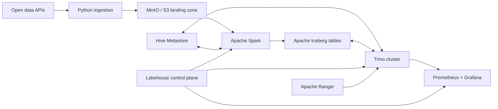

# Lakehouse Ops Platform

A production-like reference platform for operating an Apache Iceberg lakehouse—not
just starting containers. The project combines a reproducible local data platform
with a Python control plane for ingestion, table health, maintenance, access policy,
observability, and performance experiments.

> Status: foundation milestone. The Open-Meteo ingestion path is implemented and
> tested. The distributed lakehouse stack is intentionally delivered in subsequent,
> independently reviewable milestones described in the roadmap.

This repository follows an **early-access, always-runnable** model. Releases stay in
the `0.x` line while interfaces evolve, but every version has a documented working
path. Planned components never masquerade as implemented features.

## Why this project exists

Lakehouse demos often stop at a successful `SELECT`. Operations begin after that:
small files accumulate, snapshots need retention policies, concurrent workloads
compete for resources, permissions drift, and changes need an audit trail. This
repository makes those concerns executable and measurable.

## Target platform



The planned stack is Trino, Spark, MinIO as an S3-compatible object store, Apache
Iceberg, Hive Metastore backed by PostgreSQL, Ranger, Prometheus, Grafana, and an
optional ClickHouse serving path. Everything runs locally with free/open-source
software. Open-Meteo is used only for a non-commercial portfolio workload under its
free API terms; deterministic fixtures keep CI independent of the external service.

## First working slice

The `lakeops` CLI fetches a bounded weather forecast, validates the columnar response,
and writes the original payload to an idempotent, checksum-addressed landing path.
Writes are atomic so a failed process cannot expose a partial object.

```bash
uv sync --dev
uv run lakeops ingest-weather \
  --name moscow \
  --latitude 55.7558 \
  --longitude 37.6173 \
  --forecast-days 3 \
  --output data/landing
```

Run the quality gate:

```bash
uv run ruff check .
uv run pytest
```

## Engineering scope

| Capability | Evidence planned in this repository |
|---|---|
| Trino operations | coordinator/worker topology, resource groups, query analysis, safe upgrades |
| Iceberg operations | partition evolution, compaction, snapshot expiration, time travel, schema evolution |
| Spark integration | idempotent batch pipelines, MERGE, maintenance procedures, failure recovery |
| S3 integration | MinIO policies, landing/warehouse layout, retries, consistency-oriented tests |
| Authorization | central role model, Ranger policies, row filters, column masking, audit trail |
| Observability | SLOs, OpenMetrics dashboards, alerts, query and table-health metrics |
| Performance | reproducible benchmark datasets, baselines, explain plans, before/after reports |
| Operations | runbooks, ADRs, release notes, disaster-recovery and failure-injection exercises |

See [Architecture](docs/architecture.md), [Roadmap](docs/roadmap.md), and the
[Release policy](docs/release-policy.md). Architecture choices are recorded as ADRs,
starting with [Hive Metastore first](docs/adr/0001-hive-metastore-first.md).

## Project principles

- Every milestone must end in executable evidence: a test, metric, benchmark, or runbook drill.
- No credentials, paid APIs, or cloud account are required for the default path.
- Versions are pinned and upgrades are reviewed as explicit changes.
- Documentation describes implemented behavior; future work is labelled as planned.
- Commit history reflects real engineering work and is never backdated or fabricated.

## License

MIT
